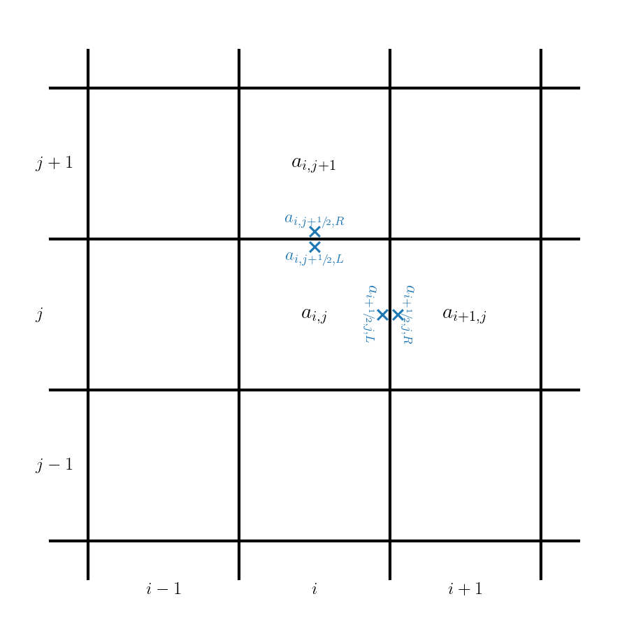

# Two-dimensional advection

The linear advection equation in 2-d is:

$$a_t + u a_x + v a_y = 0$$

In conservative form, we'd write this as:

$$\frac{\partial a}{\partial t} + \frac{\partial (u a)}{\partial x} + \frac{\partial (v a)}{\partial y} = 0$$

We can develop a finite volume method by defining an average as:

$$\langle a \rangle_{i,j} = \frac{1}{\Delta x \Delta y} \int_{x_{i-1/2}}^{x_{i+1/2}} \int_{y_{j-1/2}}^{y_{j+1/2}} a(x, y) dx dy$$

and our final update would look like (dropping the $\langle \rangle$):

$$\frac{\partial}{\partial t} a_{i,j} = - \frac{1}{\Delta x} (F^{(x)}_{i+1/2,j} - F^{(x)}_{i-1/2,j}) - \frac{1}{\Delta y} (F^{(y)}_{i,j+1/2} - F^{(y)}_{i,j-1/2})$$

where $F^{(x)} = u a$ and $F^{(y)} = v a$.

This can be solved using the same method-of-lines technique we did in
1-d, but now we need to create and manage a 2-d grid, fill ghost cells
on both $x$ and $y$ boundaries, and compute fluxes through both $x$
and $y$ interfaces.

The flux computations are done simply by
reconstructing in one coordinate direction and solving the Riemann
problem in that direction.

Code up a 2-d advection solver and test it on advecting a Gaussian.

The timestep limiter needs to be adapted a bit, and is now:

$$\Delta t = C \left [ \frac{u}{\Delta x} + \frac{v}{\Delta y} \right ]^{-1}$$
